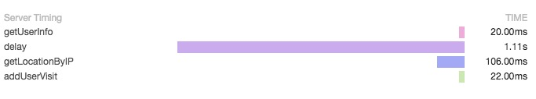

# 不能不说爱上你：async_hooks

虽然说做后端开发也有好几年了，但是真正熟悉的只是`node.js`，对于其它的语言都只停留在初级阶段。第一次了解到`thread local`是在系统接入`zipkin`的时候，另外一个后端开发的同事在抱怨不知道在`node.js`中怎么可以方便的传递`traceId`，以及和我讲解了在其它语言中`thread local`的使用。于是为了避免傻傻的将`traceId`一直当参数的传递，上网搜索了一下，居然还真有相关的实现，使用`domain(已废弃)`来模拟，我们就去研究了一下`domain`的实现，那代码还真古怪加古怪，后来还是决定放弃了，性能的统计只做关键的记录统计，不做太细化，参数的形式也还是可以接受的。

项目上线稳定运行，随着用户量的增长，慢慢日志越来越多了，这个时间才发现没有一个规范的日志简直就是一个深坑，用户反馈出问题的时候，没办法准确定位到相应的日志，只能通过把客户的所有日志都查出来，再根据时间人眼一个个排查，这实在是太累了。而`zipkin`使用得太简陋，一般只有2，3个主要子调用的时间统计，但是究竟慢在哪一部分，这也没办法去精确定位，一直想解决但没有想到好的办法去解决，因此一直拖着拖着。

无论是日志还是统计，如何解决关联性是最根本的问题（`thread local`的实现），之后一直有关注相关的`node.js`实现，`AsyncWrap`的实现我以为还有一段时间才会真正出来，没想到`8.0`版本的更新的时候，`async_hooks`已经成为正式的内置实现模块，虽然还是处于`Experimental`的阶段，但经过试验已经完全可以使用。

## 残酷的现状

项目主要是使用`koa`实现`REST`服务，下面是模拟的一种简单场景，接收到请求 --> 从mongodb获取用户信息 --> 随机延时执行 --> 根据访问IP地址获取用户定位 --> 用户访问记录写入到mongodb --> 返回响应数据

由于系统是`REST`服务，因此在请求发起端（浏览器或其它客户端）会生成一个`X-Request-Id(traceId)`，怎么将方便将这个`traceId`从各函数调用中取出则是解决问题的关键。

流程的处理代码如下：

```js

function log(...args) {
  console.info(util.format(...args));
}

// 接收请求，获取ID
app.use((ctx, next) => {
  const id = ctx.get('X-Request-Id') || shortid();
  log(`start the request of ${id}`);
  return next();
});

// 获取用户信息
app.use(async (ctx, next) => {
  const account = ctx.query.account;
  if (account) {
    ctx.state.user = await getUser(account);
  } else {
    ctx.state.user = {
      name: 'anonymous',
      email: 'unknown',
    };
  }
  return next();
});

// 延时执行
app.use(async (ctx, next) => {
  const start = Date.now();
  await delay(_.random(3000));
  const use = Date.now() - start;
  log(`delay ${use}ms`);
  return next();
});

// 根据IP获取客户定位
app.use(async (ctx, next) => {
  const start = Date.now();
  const url = 'http://ip.taobao.com/service/getIpInfo.php';
  const res = await request.get(url)
    .set('Accept', 'application/json')
    .query({
      ip: '8.8.8.8',
    });
  const use = Date.now() - start;
  log('get location by ip ', res.text, ` use ${use}ms`);
  return next();
});

// 记录用户访问
app.use(async (ctx, next) => {
  const name = ctx.state.user.name;
  const start = Date.now();
  await new UserVisit({
    name,
  }).save();
  const use = Date.now() - start;
  log(`add ${name} visit use ${use}ms`);
  return next();
});

// 响应请求
app.use((ctx) => {
  const user = ctx.state.user;
  ctx.body = `Hello world, ${user.name}:${user.email}`;
});
```

下面我们来当请求`http://127.0.0.1:3050/?account=vicanso`时输出的日志：

```
start the request of Skm28Ezm-
get info use 16ms
delay 2040ms
get location by ip  {"code":0,"data":{"country":"\u7f8e\u56fd","country_id":"US","area":"","area_id":"","region":"","region_id":"","city":"","city_id":"","county":"","county_id":"","isp":"","isp_id":"","ip":"8.8.8.8"}} use 301ms
add visit use 18ms
```

上面输出的日志中，都没有用户信息以及当前请求的ID，当需要做日志分析的时候，就很难将日志与用户的问题反馈匹配得上，很多时候我们只能没办法的选择将`id`与`user.name`以参数的形式往后面的函数调用中，而函数调用的层次多了，这种做法也完全不是尽头，最终只能将主要的日志增加用户相关的信息。

## 美好的展望

- 对于日志输出，希望能从获取得了调用链开始设置的`id`，方便直接把单一调用的所有日志筛选

- 对于日志输出，希望能够输出当前相关的用户信息，方便将某客户的所有相关日志输出

- 对于性能统计，希望能在调用链中简单的增加函数调用时间记录

对于上述的场景，有了`async_hooks`，一切都皆有可能，调整上面的代码，如下：

```js
function log(...args) {
  const id = als.get('id') || 'unkonwn';
  const user = als.get('user') || 'anonymous';
  args.unshift(user, id);
  console.info(util.format(...args));
}

// 接收请求，获取ID并设置X-Response-Id
app.use((ctx, next) => {
  const id = ctx.get('X-Request-Id') || shortid();
  ctx.set('X-Response-Id', id);
  als.set('id', id);
  als.set('timing', new Timing({
    precision: 'ms',
  }));
  return next();
});

// 获取用户信息
app.use(async (ctx, next) => {
  const account = ctx.query.account;
  const start = Date.now();
  const end = als.get('timing').start('getUserInfo');
  if (account) {
    ctx.state.user = await getUser(account);
  } else {
    ctx.state.user = {
      name: 'anonymous',
      email: 'unknown',
    };
  }
  als.set('user', ctx.state.user.name);
  const use = Date.now() - start;
  log(`get info use ${use}ms`);
  end();
  return next();
});

// 延时执行
app.use(async (ctx, next) => {
  const start = Date.now();
  const end = als.get('timing').start('delay');
  await delay(_.random(3000));
  const use = Date.now() - start;
  log(`delay ${use}ms`);
  end();
  return next();
});

// 根据IP获取客户定位
app.use(async (ctx, next) => {
  const start = Date.now();
  const end = als.get('timing').start('getLocationByIP');
  const url = 'http://ip.taobao.com/service/getIpInfo.php';
  const res = await request.get(url)
    .set('Accept', 'application/json')
    .query({
      ip: '8.8.8.8',
    });
  const use = Date.now() - start;
  log('get location by ip ', res.text, ` use ${use}ms`);
  end();
  return next();
});

// 记录用户访问
app.use(async (ctx, next) => {
  const name = ctx.state.user.name;
  const start = Date.now();
  const end = als.get('timing').start('addUserVisit');
  await new UserVisit({
    name,
  }).save();
  const use = Date.now() - start;
  log(`add visit use ${use}ms`);
  end();
  return next();
});

// 响应请求
app.use((ctx) => {
  const user = ctx.state.user;
  const timing = als.get('timing');
  log(timing.toString());
  ctx.set('Server-Timing', timing.toServerTiming());
  ctx.body = `Hello world, ${user.name}:${user.email}`;
});
```

通过在入口位置设置`id`属性（该属性要求从HTTP请求发起端生成，如果未生成则自动生成），在获取用户信息之后，将`user`属性也设置好。在日志输出函数，通过`async_hooks`的处理，获取其调用链中设置的`id`与`user`的数据，直接插入到日志最前输出，日志如下：

```
vicanso r1JPybNXW get info use 19ms
vicanso r1JPybNXW delay 1115ms
vicanso r1JPybNXW get location by ip  {"code":0,"data":{"country":"\u7f8e\u56fd","country_id":"US","area":"","area_id":"","region":"","region_id":"","city":"","city_id":"","county":"","county_id":"","isp":"","isp_id":"","ip":"8.8.8.8"}}  use 105ms
vicanso r1JPybNXW add visit use 21ms
vicanso r1JPybNXW getUserInfo[20ms] delay[1114ms] getLocationByIP[106ms] addUserVisit[22ms]
```

从上面的日志可以看到，对于单一个请求的所有函数调用中的输出，都已添加了用户名与ID，并且在响应时设置了`X-Response-Id`，因此在客户端中显示出错信息的时候，只要把`X-Response-Id`也显示出来，当客户反馈问题的时候可以直接定位整个流程的所有日志。

在日志中使用`timing`来将流程中的每个主要函数都增加了调用时长的统计（每一条日志的 use xxxms只是为了方便对比而增加，实际可以去除），并记录到`Server-Timing`中（为了演示代码的方式，我并没有写入到zipkin），方便前端开发直观的看到系统的响应时长，如下：



## 结语

`async_hooks`简化了函数调用中关联性的问题，对于函数调用链以简单的方式串联，大大减少了问题定位的排查时间以及可以更细化的函数调用时序图，由于是处于`Experimental`阶段，建议大家使用但也请慎用。
