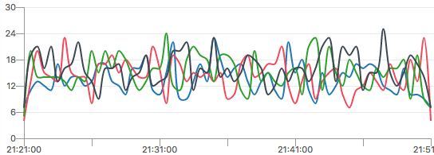
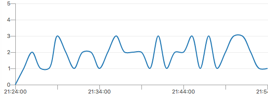
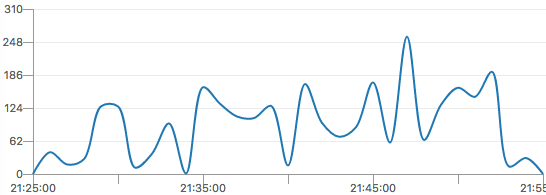
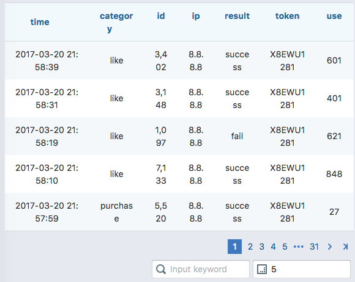

# 使用influxdb有感

在做开发的这些年来，一直都在想怎么衡量对系统的优化是否有效，怎么能更便捷的监控系统是否稳定，怎么才能满足业务或者产品对于一些简单统计的需求。曾经试用过`statsd`，但是它的统计比较单一，不好满足一些多维度的统计需求，也试过自己去开发，最终也只能放弃，实在是太麻烦了（技术不够），最后接触了`influxdb`之后，慢慢的以前的统计工作都转移到`influxdb`上。

## InfluxDB 简介

InfluxDB is a time series database built from the ground up to handle high write and query loads. It is the second piece of the TICK stack. InfluxDB is meant to be used as a backing store for any use case involving large amounts of timestamped data, including DevOps monitoring, application metrics, IoT sensor data, and real-time analytics.

上面的这一段`influxdb`的介绍，在我了解了它的`point`的组成之后，我对于它的数据实时统计、分析是没有什么怀疑的（point的组成后面有所介绍），但是它的性能，一开始我是有所怀疑，因为它使用的是http的方式来写入数据（也有UDP的方式，不过每个measuremnt都要自己配置），后来看到它的`Writing multiple points`，一次`post`中提交多个point的做法（我一般一次提交100个），性能上完全不是大问题。


### InfluxDB 的统计记录点

下面来看一下`influxdb point`的组成：

```
+-----------+--------+-+---------+-+---------+
|measurement|,tag_set| |field_set| |timestamp|
+-----------+--------+-+---------+-+---------+
```

- measurement 在influxdb中，可以把它等同于sql中的table
- tag_set 统计point的tags，所有的tag会被索引，其value值只能使用string，主要于在数据展示中group by之类（后面会讲解如果使用tag和field）
- field_set 统计point的fields，该值不会被索引，因此如果对field做查询会比较慢，一般用于记录取值范围较大的数据
- timestamp 该point的生成时间，如果不传该值，influxdb在写入该point的时候，会自动生成

### InfluxDB 的一次多统计记录点写入

下面来看一个使用http post方式写入数据到`influxdb`的例子：

```bash
curl -i -XPOST 'http://localhost:8086/write?db=mydb' --data-binary 'cpu_load_short,host=server02 value=0.67
cpu_load_short,host=server02 value=0.55
cpu_load_short,host=server01 value=2.0'
```

```
name: cpu_load_short
time			host		value
----			----		-----
1482852780289952742	server01	2
1482852780289952742	server02	0.55
```

上面的例子中，应该是写入的三个`point`，但是最终查询的时候，发现只保存了两条，那么是为什么呢？这里大家必须明确一点，在`influxdb`中，tag_set + timestamp 用于标识是否同一条记录，如果有两条记录该值相同，后面的记录的field_set会覆盖前面的值。在使用客户端的`write multi points`的方法的时候，如果保存数据的时候，不写入`timestamp`字段，在一次往`influxdb`写数据的时候，就会好像上面的例子一样，所有的`point`使用同样的`timestamp`，如果写入的这些`point`当中，有tag_set是相同的，那么最终只会写入了一条记录。

这个应该怎么避免了，将数据缓存再写入的时候，填充`timestamp`字段？是的，我最开始也是这样的想法，因此每条记录都会调用`Date.now()`来生成`timestamp`(我使用的是node.js，取ms的timestamp比较简单)。开始使用了一段时间，发现数据还是对不上号,有所缺失，跟踪日志，发现接口都是有调用成功的，后来才留意到，因为我的程序不止一个实例，在多个实例中，`ms`级别的`timestamp`还是会有冲突的可能性存在，最终调整至`ns`级别之后，没有发现再有统计缺失。因此在使用`write multi points`的时候，最好还是自己把`timestamp`带上，而且精度要足够，那种直接使用`s`级别的，就真的要认真考虑考虑了。

* 注：原则上ns因为不同的实例中还是有可能会存在覆盖，但是要tag_set + timestamp(ns) 都相同，这个概率我觉得可以忽略了。

### InfluxDB 中 tag_set 和 field_set 的选择

对于`tag_set`和`field_set`应该怎么选择，这个我讲一下个人见解。一般来讲`tag_set`可以认为是一种分类，在同一个`measurement`中，这些`point`能怎么分类，统计展示时，希望怎样的分组，那么就应该选择保存为`tag`。`field`对于这个`point`，它是比较特别的一个数据，并不是说一定和其它的`point`就一定无关，但是它的关联性没有那么大，而且一般来说，它的可取值范围都是比较大的。下面我们通过两组例子来说明一下：

#### HTTP响应的性能统计

- `method` 请求的HTTP method
- `url` 请求的HTTP url
- `status code` 响应的HTTP status code
- `content-lenght` 响应的数据大小
- `use` 响应该请求的处理时间
- `request ip` 该请求的访问IP（用户IP）
- `user-agent` 该请求的User-Agent

对于`method`，统计展示的时候，有可能我希望能得到`GET` `POST` `PUT` `DELETE` 等操作的占比，或者看一下`GET`请求的响应之类，因此我将`method`以`tag`的形式保存

对于`url`，因为有可能`query`部分还带有不同的参数，一般做统计的时候，不会按`url`做group by之类，一般都是出错（通过status code）的请求有哪些url。当然有些需要可能需要统计某些url请求的次数之类，这个我就建议使用url中的pathname，而不要直接使用url。我自己在实际中一般都是记录路由的调用次数，如：`/book/:id`这种。

对于`stats code`，平时统计的时候，有可能希望能反映系统的状态，出错率有多少之类，这个时间就会根据`status code`做group by，但是`status code`有这么多，如果不做分类，group by出来的结果也比较乱，无法直观展示，因此我做了如下处理`(statusCode / 100) | 0`，将`status code`分类为1xx, 2xx, 3xx, 4xx, 5xx，使用type: ['1', '2', '3', '4', '5'] 的方式来生成tag，方便做统计，而`status code`则当成field来写入。在后续的监控中，我只要根据`type`来生成统计曲线图，就能实时看出系统是否有异常

对于`content-length`这个我暂时也只是直接以field的形式记录。

对于`use`响应时间这个的统计，以前我都是习惯直接使用，看统计的时候就取平均值，后来越来越发现取平均值的做法不对，没办法很细致的体现出系统的性能是不是真的好。平时在监控系统的时候，我其实不太关注接口的响应时间是`1ms`还是`10ms`，这两者对于当前系统来说，都是很好，因此我将响应时间分段，小于`10ms`的认为很好，级别是`0`;`10ms-100ms`的认为是不错，级别是`1`，通过这样的方式来生成`spdy`这个tag, `spdy = _.sortedIndex([10, 100, 300, 1000, 3000], use)`，之后我的性能监控就可以按`spdy`分组，我只要关注请求响应的分布就能看出当前系统的是否稳定运行

`request ip`这个我也是直接当`field`来记录

`user-agent` 这个值，我从中判断是移动还是PC浏览器，生成tag保存，后续使用该tag来看接口调用的占比，方便后续优化时的方向

上面已经说了我是怎么考虑`tag_set`和`field_set`的生成的，下面看例子：

```
GET "/users/me" 200 1324 5 8.8.8.8 "Mozilla/5.0 (Macintosh; Intel Mac OS X 10_11_6) AppleWebKit/537.36 (KHTML, like Gecko) Chrome/55.0.2883.95 Safari/537.36"
```

这个请求的响应生成的`point`就如下：

```
http,device=pc,method=GET,spdy=0,type=2 url=\"/users/me\",code=200i,contentLength=1324i,use=5i,ip=\"8.8.8.8\"
```

#### 站点的小说订阅统计

- `name` 小说名称
- `author` 小说作者
- `category` 小说类型
- `free` 是否免费小说
- `vip` 用户是否vip
- `source` 用户访问小说的来源：首页、搜索等等
- `amount` 支付金额

对于这类产品相关的统计，一般都是根据产品的需要，对数据进行分类。假定产品需要了解哪类小说比较受欢迎，收费与免费小说的收藏占比，vip用户的占比，还有客户一般从哪个入口的有效流量比较多。因此将`category free vip source`都以tag的形式保存，其它字段以field保存

对于如果区分使用tag还是field，首要满足的是统计分析展示的需要，而tag是有索引的，查询速度快（因此每个tag的可选值范围也不要太大）,field则是使用做sum、mean等计算（一般都是一些特别的计算值，如购买产品金额等等）

#### 用户操作日志流水

在以前的系统中，如果要查看一下某个用户特定时间的操作，都是通过从日志中分析，而日志中输出的内容实在是有点点（较多不确定有用无用的数据都输出了），而对于直接跟踪用户的行为日志，无法直观的查看，因此后期我也将用户的操作以流水的形式记录到influxdb中。

首先来对于用户的操作，主要关注的是添加、更新、删除等操作（对应HTTP POST PUT DELETE），而需要记录的参数也需要单独定义（一开始考虑过把所有的参数都记录，后来怕不小心记录一些敏感信息，因此还是通过定义的方式），对于每个需要做记录的路由增加中间件的处理，下面是使用koa的例子：

```js
/**
 * 记录用户的行为日志到influxdb中
 * @param  {Object} data 用户行为日志数据
 */
function logUserTracker(data) {
  console.info(`user tracker ${stringify.json(data)}`);
  const tags = 'category result'.split(' ');
  influx.write('userTracker', _.omit(data, tags), _.pick(data, tags));
}

/**
 * 生成行为日志中间件，根据设置的参数列表获取用户提交的参数，
 * 以后最后的结果，记录到influxdb中
 * @param  {String} category 该用户行为分类，如：用户注册、用户收藏
 * @param  {Array} params   参数列表, 如：["name", "code"]，
 * 取参数的优先顺序是：ctx.request.body --> ctx.params --> ctx.query
 * @return {Function} 返回中间件处理函数
 */
const tracker = (category, params) => (ctx, next) => {
  const data = {
    category,
    // 也可以通过从session中获取当前用户账号，记录账号
    token: ctx.get('X-User-Token'),
    ip: ctx.ip,
  };
  _.forEach(params, (param) => {
    _.forEach(['request.body', 'params', 'query'], (key) => {
      const v = _.get(ctx, `${key}.${param}`);
      if (_.isNil(data[param]) && !_.isNil(v)) {
        data[param] = v;
      }
    });
  });
  const start = Date.now();
  const delayLog = (use, result) => {
    data.result = result;
    data.use = use;
    logUserTracker(data);
  };
  return next().then(() => {
    setImmediate(delayLog, Date.now() - start, 'success');
  }, (err) => {
    setImmediate(delayLog, Date.now() - start, 'fail');
    throw err;
  });
};

router.post('/like/:id', tracker("user-like", ["code"]), (ctx) => {
  return User.like(ctx.params.id).then(() => {
    return ctx.status = 201;
  });
});
```

使用tracker中间件之后，对于用户like的操作，会记录tags: category, result以及fields:token, ip, use, code(自定义的参数)，在对各POST, PUT, DELETE的路由都增加tracker中间件之后，用户的操作日志就可以简单的通过用户token直接把限定时间段的日志全部展示出来。

### InfluxDB Functions

influxdb中提供一系列的`Aggregations`来方便展示的展示，如`count`计算总次数， `sum`计算总和， `mean`计算平均值等，还有`Selectors` `Transformations`等等，这里就不一一详解，大家可以去官网上看[文档](https://docs.influxdata.com/influxdb/v1.2/query_language/functions)。

下面根据上面所说的两个例子，讲解如果生成相应的统计图：

- 对于HTTP的响应，我首先需要关注的就是`http status`，是正常的`20x`, `30x`还是错误的`40x`与`50x`等，所以我将是5分钟的间隔，对HTTP的统计做group by `type`的分组，计算各`type`出现的数量，如果`4`与`5`出现的总数在期望值以下，那么就认为系统各功能总体正常

```influx-ql
select count("url") from "mydb".."http" where time >= now() - 2h group by time(5m),"type"
```


- 对于HTTP的响应，`type`只能看出系统功能是否正常，但是性能如何就需要通过`spdy`来衡量了，也是以5分钟的间隔做group by `spdy`，计算各`spdy`出现的数量


```influx-ql
select count("url") from "mydb".."http" where time >= now() - 2h group by time(5m),"spdy"
```


- 对于小说订阅的统计，主要关注订阅的量，以5分钟的间隔count订阅的总数，直接通过这个总数来反映系统是否正常

```influx-ql
select count("book") from "mydb".."subscription" where time >= now() - 2h group by time(5m)
```


- 对于小说订阅的统计，主要关注支付的量，也是以5分钟的间隔sum(amount)的值，从而反映出订单与支付业务是否正常

```influx-ql
select sum("amount") from "mydb".."order" where time >= now() - 2h group by time(5m)
```


- 用户行为日志流程

```influx-ql
select * from "mydb".."tracker" where time >= now() - 2h
```


- 购买人次

```influx-ql
select count(distinct(account)) from "mydb".."order" where time >= now() - 2h
```

### 附：

- 上面例子中node.js中写入数据至influxdb使用的是[influxdb-nodejs](https://github.com/vicanso/influxdb-nodejs)
- 上面例子中展示截图中展示数据用到的是[aslant](https://github.com/vicanso/aslant)
