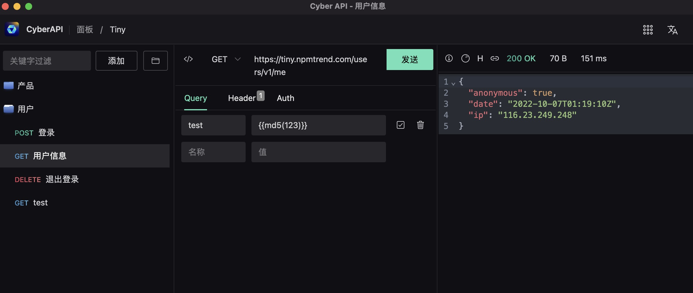

# 基于tauri打造的HTTP API客户端工具-CyberAPI

国庆长假和朋友聚会的时候，和朋友谈起最近这段时间捣鼓tauri，写了一个HTTP API客户端工具。『你写了这么多东西，其实有想过是为了啥不？』为了啥这是一个很大的命题，当初每个项目的时候都想过它应该解决些啥，最终每个项目好像完成了它的使命，也好像还在征途之上。不是每个人的追求都是诗和远方、星辰大海，而我只是闲着也是闲着，所以做了点啥，不是为了啥。

选择使用`tauri`并不是因为它的优缺点，只是因为我自己想学习一下rust(不要问我有没有学会，再问就没办法聊天了)，在了解过一些rust比较热门的项目之后，刚好也想学习一下桌面应用开发，因此[CyberAPI](https://github.com/vicanso/cyberapi)也在此巧合之下开始创建。

CyberAPI大概在6月中的时候开始，到现在基本4个月左右，由于rust完全不会，开发过程一堆的坑坑洼洼，个中辛酸不说，这年头谁没遇到点苦难，但是无言以对的是，我觉得自己现在还是完全不会rust。开始CyberAPI的过程中主要遇到以下几个问题：

- 基于系统自带的webview，可能存在兼容性问题(开发时遇到windows的webview2性能较好，而macos的webkit性能差一点导致拖动不流畅)
- javascript与rust调用如果大数据交互(10MB)，处理时间会有3秒左右(tauri已知issue，官方在下一版本优化)
- 最开始选择所有的数据均保存至浏览器IndexedDB，存储的数据较多因此切换至sqlite
- 支持Dark/Light主题，部分组件未自适应调整
- 多语言支持未实现实时变化，通过设置后重启应用解决

上面的问题其实都只是小问题，虽然系统托盘以及自动升级当前版本并未使用上，tauri对我而言已经可以满足桌面应用开发，精通WEB前端的开发者，完全可以直接基于浏览器实现绝大部分的功能，有边缘项目的可以考虑尝尝鲜，但是其各类的插件还是较少，如果项目更多的依赖于系统接口，则建议对rust有较深功底再入坑。

下面介绍一下CyberAPI的主要特性：

- 支持macos、windows以及linux平台，安装包均在10MB以下(rust编译强行精简)
- 单个项目上千个接口秒级打开，内存占用较低(电脑较好,mac air m2)
- 支持Dark/Light主题以及中英语言(英文翻译较差)
- 简单易用的操作及配置方式(对我而言)
- 可快速导入postman与insomnia的配置(拉新专用)
- 关键字筛选支持中文拼音或者首字母(中国人必备)
- 可按接口、按功能、按项目导出配置，方便团队内共用(我只是个人使用)
- 各类自定义的函数，方便各请求间关联数据(我用的较多)

    

CyberAPI的缺点则是：没有缺点(自己的项目，打死都要撑着)。不过由于只是个人的业余项目，如果有优化建议只能尽可能支持，如果是BUG则必须支持的(不能打脸，我也不会硬撑说不是BUG)，如果大家使用得开心的，那小手一点给个Star，如果用得不开心那更要Star之后，哪天心情不爽就过来骂一下，对不对。

项目在github上开源，开源协议为Apache License 2.0，可以放心使用，地址为：[https://github.com/vicanso/cyberapi](https://github.com/vicanso/cyberapi)
