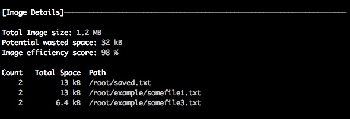
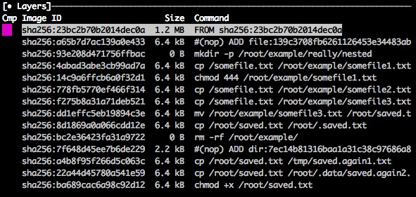
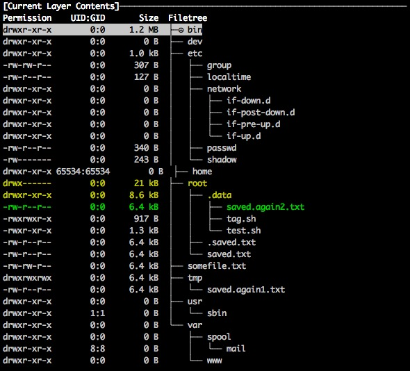

# 前言

在docker已经成为标配的时代，镜像的优化建议大家都耳熟能详，如指令串联减少layer的层，使用更小的基础镜像等等。而在实际使用过程中，生成出来的镜像从100MB到1GB大小都有，大家都觉得已经按照建议优化了，已经尽力了。最开始的时候，还坚持对一些较大的镜像`一起来找茬`，看看能做哪些优化。随着项目的增多，只以镜像大小论英雄的方式实在java哭nodejs笑（只是在为我们的镜像一般都是java项目较大，nodejs较小，不代表具体意义）。最终只能是随机选择镜像审查（其实目的就是给大家压力，不要随便搞），对于镜像要求不能超过上限1GB（正如挤挤还是有的），除非另外申请。

在我们一段时间的镜像审查中，发现一个普遍的现象，镜像越小的反而越大机会存在空间浪费的情况（无用的文件、重复覆盖的文件或者被删除的文件等）。因为对于小镜像，增加了20MB，30MB，也就是从100MB级别增长到200MB级别，大家真的没有太在意，无自动化工具的支持，只能且行且将就~

人生总有亮光，程序员总不会单身一辈子的，dive的出现终于给我们较可行的镜像评分方案。

# dive

dive是一个可以查看docker镜像的工具，可以获取镜像的分层，分层的文件信息（增删改），重复出现或删除的文件（无用空间的浪费）等。

## 镜像概况

`Total Image size`: 总的镜像大小
`Potential wasted space`: 可能的浪费空间（根据文件覆盖、删除等计算得到）
`Image efficiency score`: 根据各层中浪费的空间大小估算的镜像得分

根据镜像的概况，我们将得分少于0.9（最大为1）的镜像标记为可优化镜像，并将浪费空间对应的相应文件展示（dive中可获取相关信息）

## 分层概况

针对镜像的分层情况，我们主要分析以下几点：

- 对于基础镜像（最底层）大于500MB的，建议选择更小的基础镜像，如基于alpine的镜像。
- 对于分层大于10层的镜像，建议调整指令，是否已使用串连的形式，获取各层的命令汇总展示。
- 除基础镜像外的所有层总大小如果大于500MB的，建议分析每层添加的文件是否有无用文件（因为镜像中的文件是否有用到只能由开发人员确认），并汇总各层新增、修改文件大于1MB的文件列表。
- 汇总各层的无用文件（我们定义为.pdf .txt .doc等一些文档文件不应该出现在镜像中），如果超过100MB的也建议优化

## 总结

dive提供了对docker镜像的层的文件信息，通过这些文件信息，我们可以更精准的对镜像提出合理的优化建议，不再是两眼摸黑乱指定。只是使用了简单的分析方式，也将我们现有的镜像优化了30%左右。

想了解更多dive的相关使用可以至[github dive](https://github.com/wagoodman/dive)上浏览，至于不想安装dive只想试验的可以尝试我业余开发的网页版[https://diving.aslant.site/](https://diving.aslant.site/)，大家在使用网页版的时候，可以尝试`redis`（镜像需要先下载，如果其它未下载镜像会很慢很慢，因为大家都懂的墙）或者使用国内的镜像源如`registry.docker-cn.com/library/redis`。还有大家在使用网页版的时候，请手下留情，不要尝试太大的镜像，因为我的最低配的服务器，小胳膊小脚，不耐操。