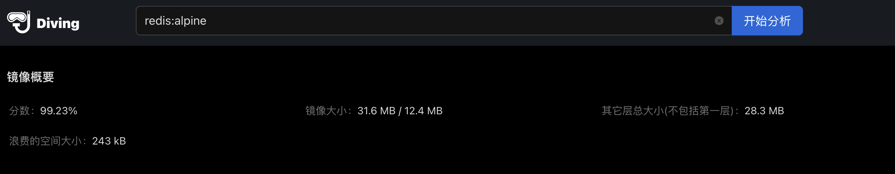
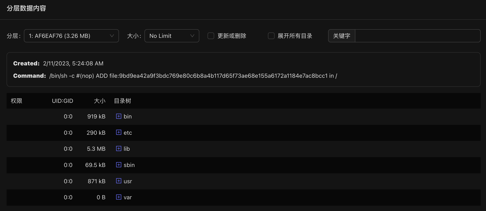
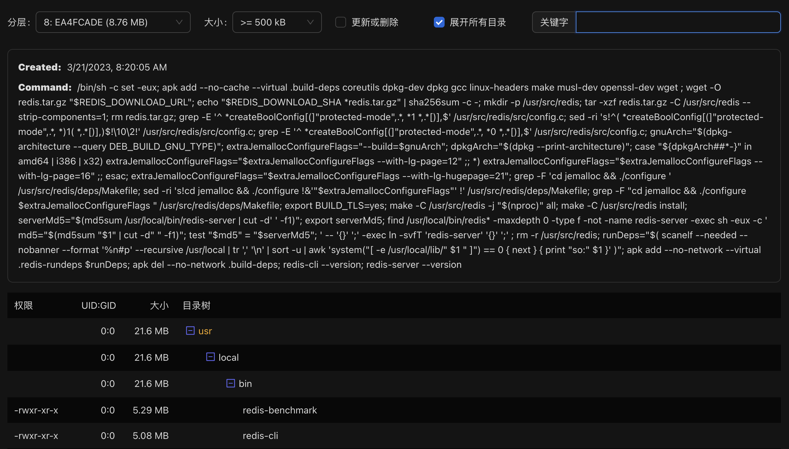

# 使用diving精简docker镜像

在docker支持多阶段构建(multi-stage builds)之后，构建运行时的镜像仅将在最后阶段复制依赖的文件即可，对于`golang`与`rust`等仅需要复制运行文件即可。基于`alpine`为基础镜像构建，基本均在20MB以下。

## 镜像Layer汇总

docker镜像由一层层的layer构成，第一层为基础镜像，而后面的镜像为构建脚本时生成的，在针对layer分析时需要一层层的来优化考虑。

基础镜像为运行镜像的最底层，建议考虑选择`alpine`等精简的镜像，也仅安装运行时所依赖的模块，减少引入各种漏洞的风险。

首先可以先看镜像汇总，其包括4项指标：

- `分数`: 根据layer中浪费的空间等数据计算的分值，可作为镜像优化的直观指标
- `镜像大小`: 镜像所有层级的汇总以及保存时压缩的大小
- `其它层级总大小`: 除基础镜像层的其它层级汇总，等同于项目构建所有添加的数据大小
- `浪费的空间大小`: 其它层级重复出现、修改或删除的文件汇总大小，此为主要优化点

由上面的4点指标可快速得出Layer的分析结论，明确第一层基础镜像是否过大（如果是可选择基于alpine），其它层级总大小是否符合预期（如果比项目预期过大则按层分析所添加数据），浪费的空间大小是否可避免（对于后续层级重复更新、删除等文件是否无效操作）。

## 镜像Layer层级分析

若感觉某个layer数据不合理时，如何针对其做具体分析呢？`docker hub`提供了构建镜像每个layer对应的命令，简单的分析可直接查看命令是否合理。而layer包括了哪些文件，以及具体相关文件的具体信息则需要具体解析layer的目录树才可获取，`docker`运行时则是将所有layer解析后层级重叠汇总完整目录树。

如上所示，镜像分层数据可按层级选择、按文件大小过滤、按是否更新或删除过滤（每层的文件均为新增，因此无需提供是否新增过滤）、文件名称搜索等功能，通过以上的筛选配置，则可快速分析该层数据是否有优化空间。常用的方法如下：

- `选择分层+勾选更新或删除选项+展开所有目录`: 查看每层更新或者删除了的文件，确认此类操作是否可以精简，避免无效数据的产生
- `选择分层+勾选文件大小>=1MB+展开所有目录`: 查看每层较大的文件(可按场景选择不同的大小过滤)，判断此类文件是否应用运行时所需，若非必须可在生成时避免此类大文件的生产
- `选择分层+关键字筛选`: 可以筛选每层中的无效文件，例如压缩包、文本文件等(需要注意明确是否的确无需使用) ，也可下载该文件确认内容

## 小结

diving提供快速便捷的镜像分析方式，可以定期针对项目镜像汇总生成分析报告，优化镜像构建逻辑，精简避免无效镜像数据。diving提供了terminal与以web形式，web的测试地址可以直接使用以下地址：[https://diving.npmtrend.com/](https://diving.npmtrend.com/)