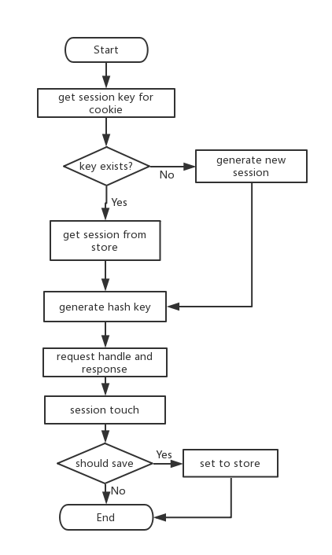

# Express中Session的优化

在使用node.js做WEB开发中，[`express`](http://expressjs.com/)因为简单易用，插件丰富而大受开发者的欢迎，但也因为简单很多开发者在使用的时候没有深入考虑中间件应该在什么场合使用，直接把中间件往全局处理`app.use`一加就完事了。

最近接手了一个老旧的node.js项目，主要是基于express开发的，越来越多用户反馈响应速度越来越慢，产品要求对系统做一次优化。接手之后首先做的就是把各类的性能统计加上（没有性能统计做出来的优化都是纸老虎），收集一个星期的数据之后，性能的确是不咋的。而分析统计结果发现，读取`session`是程序中出现最多的，而在访问量大的时候，读取时间会达到`1s`，那么首先着手优化的点就是`session`的处理，该项目中所有的请求都会经过`session`的处理，而统计出来的结果，只有`30%`不到的请求是需要用到`session`的，而这些请求，又只有`20%`不到的请求是需要写`session`的。

## session处理流程



在express-session的处理流程中，主要耗时的是`get session from store`, `should save`以及`set to store`这三步部分，如何减少这三部分的调用则是优化`session`的主要手段。

## 常见的错误使用方式

```js

const uuid = require('node-uuid');
const express = require('express');
const session = require('express-session');
const onHeaders = require('on-headers');
const RedisStore = require('connect-redis')(session);

// about 5KB
const basicInfo = require('./basic-info');

const app = express();

const getUserInfo = () => Object.assign({
  name: uuid.v4(),
}, basicInfo);

app.use(session({
  store: new RedisStore({
    ttl: 3600,
  }),
  resave: false,
  saveUninitialized: false,
  secret: 'keyboard cat',
}));

app.get('/user', (req, res) => {
  if (!req.session.user) {
    console.info('Create new session');
    req.session.user = getUserInfo();
  }
  res.json(req.session.user);
});

app.get('/foods', (req, res) => {
  res.json([]);
});

app.listen(7000);
console.info('Get user information from http://127.0.0.1:7000/user');

```

上面的例子中session middleware是每一个请求都会调用，这种写法很简单，不考虑后面的route是否需要用户信息，都从session中获取，牺牲了系统的性能来换取开发的难度减少，两个route的处理：

- `/user` 需要用到用户信息，因此需要调用 session middleware
- `/foods` 不需要用到用户信息，因此可以无需调用 session middleware

- `/foods`使用了`session middleware`之后的性能测试
  ```
  # use session middleware
  Document Path:          /foods
  Document Length:        2 bytes

  Concurrency Level:      100
  Time taken for tests:   11.985 seconds
  Complete requests:      10000
  Failed requests:        0
  Total transferred:      2020000 bytes
  HTML transferred:       20000 bytes
  Requests per second:    834.35 [#/sec] (mean)
  Time per request:       119.854 [ms] (mean)
  Time per request:       1.199 [ms] (mean, across all concurrent requests)
  Transfer rate:          164.59 [Kbytes/sec] received
  ```
- `/foods`不使用`session middleware`的性能测试
  ```
  # not use session middleware
  Document Path:          /foods
  Document Length:        2 bytes

  Concurrency Level:      100
  Time taken for tests:   3.786 seconds
  Complete requests:      10000
  Failed requests:        0
  Total transferred:      2020000 bytes
  HTML transferred:       20000 bytes
  Requests per second:    2641.37 [#/sec] (mean)
  Time per request:       37.859 [ms] (mean)
  Time per request:       0.379 [ms] (mean, across all concurrent requests)
  Transfer rate:          521.05 [Kbytes/sec] received
  ```

从上面的例子可以看出，在登录状态下，使用`session`之后，接口的响应速度有所增加（不到1ms），当然因为这次的测试没有太多的负载，而且也简单，因此增加的响应时间比较短（我真实项目中session的读取平均时长在200ms）。而对于 `/foods` 请求，这些处理完全是一种浪费，大家可以想想自己平时开发的应用，如果也是以这种方式使用`session`，那么是做了多少的无用功。可能很多人觉得对于小网站，这种偷懒的写法无可厚非，但是如果不是很繁琐就能减少这种性能损耗，那么我们有什么理由不做呢？

## session的读、写中间件分离

在调整`session`的处理之后，我们再查查文章开篇所说的，在HTTP处理中，对于`seesion`的使用有三种情况：

- 需要对`session`做读写操作

- 只需要对`session`做读操作

- 完全不需要`session`

```js
const uuid = require('node-uuid');
const express = require('express');
const session = require('express-session');
const onHeaders = require('on-headers');
const RedisStore = require('connect-redis')(session);

// about 5KB
const basicInfo = require('./basic-info');

const app = express();

const getUserInfo = () => Object.assign({
  name: uuid.v4(),
}, basicInfo);

const sessionMiddleware = session({
  store: new RedisStore({
    ttl: 3600,
  }),
  resave: false,
  saveUninitialized: false,
  secret: 'keyboard cat',
});

const sessionReadonly = (req, res, next) => {
  sessionMiddleware(req, res, next);
  onHeaders(res, () => {
    delete req.sessionID;
    delete req.session;
  });
};

app.get('/user', sessionMiddleware, (req, res) => {
  if (!req.session.user) {
    console.info('Create new session');
    req.session.user = getUserInfo();
  }
  res.json(req.session.user);
});

app.get('/user/readonly', sessionReadonly, (req, res) => {
  const user = req.session.user;
  res.json(user);
});

app.get('/foods', (req, res) => {
  res.json([]);
});

app.listen(7000);
console.info('Get user information from http://127.0.0.1:7000/user');
```

- `/user/readonly`使用`sessionMiddleware`的性能测试
  ```
  Document Path:          /user/readonly
  Document Length:        5395 bytes

  Concurrency Level:      100
  Time taken for tests:   12.450 seconds
  Complete requests:      10000
  Failed requests:        0
  Total transferred:      56010000 bytes
  HTML transferred:       53950000 bytes
  Requests per second:    803.21 [#/sec] (mean)
  Time per request:       124.501 [ms] (mean)
  Time per request:       1.245 [ms] (mean, across all concurrent requests)
  Transfer rate:          4393.32 [Kbytes/sec] received
  ```

- `/user/readonly`使用`sessionReadonly`的性能测试
  ```
  # readonly using sessionReadonly
  Document Path:          /user/readonly
  Document Length:        5395 bytes

  Concurrency Level:      100
  Time taken for tests:   8.593 seconds
  Complete requests:      10000
  Failed requests:        0
  Total transferred:      56010000 bytes
  HTML transferred:       53950000 bytes
  Requests per second:    1163.70 [#/sec] (mean)
  Time per request:       85.933 [ms] (mean)
  Time per request:       0.859 [ms] (mean, across all concurrent requests)
  Transfer rate:          6365.13 [Kbytes/sec] received
  ```

通过统计可以看出使用`sessionReadonly`可以减少了对`session`内容的校验是否调整，减少非必要的性能损耗（在我自己实际开发中，其实需要写session的接口只是少数，因此这种优化还是有一定的效果的）。

注：上面例子的[source code](https://github.com/vicanso/articles/tree/master/express-session)，使用koa的朋友可以使用我写的模块[koa-simple-session](https://github.com/vicanso/koa-simple-session)
