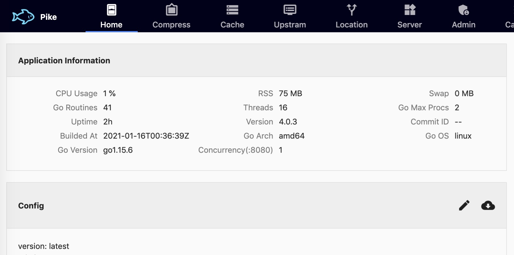

# Pike: 5分钟实现接口10倍响应提升

## 简介

Pike是参考varnish实现的http缓存加速器，使用golang开发，纯go的实现可简单编译成各系统版本，现已提供windows, macos, linux以及docker的版本，可直接在[github:pike](https://github.com/vicanso/pike)中下载对应版本，或使用`vicanso/pike:vicanso/pike:v4.0.3`版本镜像。与varnish相比，其特性如下：

- 提供WEB形式的配置管理，无中断的实时更新配置，简便易用
- 配置支持保存至文件或etcd，方便多实例部署
- 同时支持gzip与br压缩处理，自动根据客户端支持的压缩方式响应
- 基于`Cache-Control`缓存时长设置，由接口开发者定义接口是否可缓存及缓存时长
- 可配置告警回调，实时监控upstream中相关节点异常

启用命令如下：

```bash
# linux etcd，管理后台使用9013端口访问
./pike --config=etcd://127.0.0.1:2379/pike --admin=:9013
# linux file，配置文件保存在/opt/pike.yml，管理后台使用9013端口访问
./pike --config=/opt/pike.yml --admin=:9013

# docker
docker run -it --rm \
    -p 9013:9013 \
    vicanso/pike:4.0.0-alpha --config=etcd://172.16.183.177:2379/pike --admin=:9013
```

更多的性能说明可查看文档: [Pike](https://treexie.gitbook.io/pike/)



## 缓存处理

对于http缓存服务而言，最重要的是性能，但是能否简单的避免缓存出错（缓存了不可缓存的数据）决定其是否被广泛使用的根本。varnish判断缓存的处理比较复杂，主要分四类：1、对于特定的状态码(302, 307)，不可缓存；2、对于设置了Cache-Control或者Expires响应头，则从响应头中获取缓存时长；3、如果都未设置的，则使用程序启动时设置的default ttl；4、在vcl自定义的各url缓存处理。在我们的实践中，varnish由运维来配置管理，接口是否可缓存开发才清楚，因此很多时候，时间都是浪费在沟通上。实际使用时，为了避免出现事故（将不可缓存的请求缓存了），大概率的变成了开发指定哪些接口缓存，缓存多久，运维则根据开发的要求一个个接口配置，结果就是导致配置繁琐复杂，低效率的使用varnish。

Pike对于缓存的处理则简化为以下几步：

- 如果响应头有`Set-Cookie`，则返回缓存有效期为0
- 如果响应头无`Cache-Control`，则返回缓存有效期为0
- 如果响应头中`Cache-Control`包含`no-cache`，`no-store`或者`private`，则返回有效期为0
- 如果响应头中`Cache-Control`包含`s-maxage`，则优先根据`s-maxage`获取缓存有效期
- 如果响应头中`Cache-Control`包含`max-age`，则根据`max-age`获取缓存有效期
- 如果响应头中有`Age`字段，则最终的缓存有效期需减去`Age`

上面几步的处理的准则就是基于`Cache-Control`来决定缓存，如果接口未设置，则认为不可缓存，宁可性能降低也不可处理出错。Cache-Control完全是由接口处理，开发人员自主控制，运维只需要处理节点增加等配置调整，无需关注接口层面的相关信息。

Pike中对于接口(接口的标识为: Method + Host + URI)的处理主要有以下三种场景：

- 非GET、HEAD的请求，直接pass至对应的后端upstream
- 对于未知接口是否可缓存时，仅转发一个请求至后端upstream，其它相同的接口请求(标识完全一致)进入等待队列。当接口响应时，若可缓存则队列中的所有接口直接使用缓存数据响应，设置该接口状态为hit。若不可缓存，则队列中所有的接口均转发至后端upstream，并设置该接口为hit for pass
- 对于缓存中有数据的接口，若是hit for pass，直接转发至对应的后端upstream。若是hit则直接响应缓存数据

数据缓存使用多LRU的形式，缓存的KEY通过memhash计算其所在的LRU中，减少缓存中锁的冲突，提升性能。而LRU也保证了缓存中的数据不会超过配置导致内存耗尽。

注：在我们使用varnish的时候，default ttl是最坑的配置，多次出现开发对于缓存并不了解，未设置`Cache-Control`或`Expires`导致接口使用了default ttl，缓存了不应该缓存的数据，因此建议如果使用varnish，尽可能把default ttl设置为-1。

## 压缩处理

Pike支持gzip与br(绝大部分的浏览器已支持)的压缩处理，压缩主要分两种场景：

- 可缓存的数据则使用gzip:6及br:6的压缩级别压缩并保存两组缓存数据，根据请求的客户端返回对应的数据
- 不可缓存的数据则使用配置的压缩级别(可配置较低的压缩级别减少压缩时间)，根据请求客户端接受压缩类型返回对应的数据（br或gzip或不压缩）

因为压缩的数据是一次压缩多次使用，因此其压缩级别会选择较高的压缩，而缓存时也缓存两组压缩数据，后续响应时则不需要重新压缩，性能非常高。为什么不缓存未压缩的原始数据，因为常用的客户端（浏览器）均支持gzip，而不支持压缩可从gzip中解压返回。

## 无中断配置更新

Pike中的绝大部分配置都支持无中断式的更新，修改配置后会根据配置的变更，更新对应的处理流程，不中断当前正处理的请求，无感知式的配置更新。配置保存在etcd时，可快捷实现各实例配置同时更新生效。

## 性能测试

测试机器：8U 8GB内存
测试数据：数据原始长度约为140KB
测试场景：客户端支持gzip、 br以及不支持压缩三种场景，并发请求数设置为1000，测试时长为1分钟
测试结论：当客户端可接受gzip或br压缩时，测试的结果均非常接近，而客户端不接受压缩时，需要先解压数据，性能则大幅度下降

### GZIP

```bash
wrk -c1000 -t10 -d1m -H 'Accept-Encoding: gzip' --latency http://127.0.0.1:3015/repos
Running 1m test @ http://127.0.0.1:3015/repos
  10 threads and 1000 connections
  Thread Stats   Avg      Stdev     Max   +/- Stdev
    Latency    17.12ms   17.05ms 241.93ms   83.49%
    Req/Sec     6.96k     1.17k   12.88k    73.49%
  Latency Distribution
     50%   16.78ms
     75%   29.72ms
     90%   38.34ms
     99%   66.55ms
  4153511 requests in 1.00m, 40.89GB read
Requests/sec:  69123.45
Transfer/sec:    696.85MB
```

### BR

```bash
wrk -c1000 -t10 -d1m -H 'Accept-Encoding: br' --latency http://127.0.0.1:3015/repos
Running 1m test @ http://127.0.0.1:3015/repos
  10 threads and 1000 connections
  Thread Stats   Avg      Stdev     Max   +/- Stdev
    Latency    16.65ms   16.27ms 181.87ms   64.06%
    Req/Sec     7.08k     1.06k   17.58k    70.18%
  Latency Distribution
     50%   16.56ms
     75%   29.11ms
     90%   37.47ms
     99%   62.46ms
  4223664 requests in 1.00m, 36.57GB read
Requests/sec:  70302.18
Transfer/sec:    623.26MB
```

### 不支持压缩

```bash
wrk -c1000 -t10 -d1m  --latency http://127.0.0.1:3015/repos
Running 1m test @ http://127.0.0.1:3015/repos
  10 threads and 1000 connections
  Thread Stats   Avg      Stdev     Max   +/- Stdev
    Latency   319.12ms  421.34ms   2.00s    81.56%
    Req/Sec   555.57    193.17     2.54k    69.97%
  Latency Distribution
     50%   32.36ms
     75%  589.84ms
     90%  965.91ms
     99%    1.61s
  331687 requests in 1.00m, 44.85GB read
  Socket errors: connect 0, read 0, write 0, timeout 4348
Requests/sec:   5518.90
Transfer/sec:    764.11MB
```
