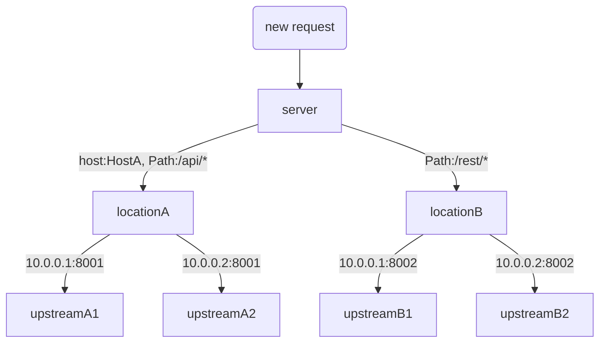

# 如何使用pingora构建自己反向代理

Cloudflare开源了其基于rust构建的反向代理框架`pingora`，已经在Cloudflare的云服务中实际使用，每秒支撑起超过4000万个互联网请求(需要注意，此处并不是性能指标)。[pingap](https://github.com/vicanso/pingap)使用pingora提供的各种模块，基于toml的配置方式，提供更便捷的方式配置反向代理。主要特性如下：

- 支持通过`host`与`path`选择对应的location
- HTTP 1/2两种方式的支持
- 无请求中断式的优雅更新
- 模板式的请求日志配置
- 基于TOML形式的程序配置

## 请求处理流程



`pingap`整体的流程简化为三步，接受到请求后基于`host`与`path`选择匹配的`location`，判断是否重写path以及设置相应的请求头，之后将请求转发至对应的`upstream`，而`pingora`的完整处理流程可以查看官方说明的[phase_chart](https://github.com/cloudflare/pingora/blob/main/docs/user_guide/phase_chart.md)，下面我们从零开始构建`pingap`。


## Upstream

upstream比较简单，支持配置多节点地址，根据指定的算法获取对应的节点，完整的实现可查看代码[upstream.rs](https://github.com/vicanso/pingap/blob/main/src/proxy/upstream.rs)。主要介绍一下其`new_http_peer`的实现：

```rust
pub fn new_http_peer(&self, _ctx: &State, header: &RequestHeader) -> Option<HttpPeer> {
    let upstream = match &self.lb {
        SelectionLb::RoundRobinLb(lb) => lb.select(b"", 256),
        SelectionLb::ConsistentLb(lb) => {
            let key = if let Some(value) = header.headers.get(&self.hash) {
                value.as_bytes()
            } else {
                header.uri.path().as_bytes()
            };
            lb.select(key, 256)
        }
    };
    upstream.map(|upstream| {
        let mut p = HttpPeer::new(upstream, self.tls, self.sni.clone());
        p.options.connection_timeout = self.connection_timeout;
        p.options.total_connection_timeout = self.total_connection_timeout;
        p.options.read_timeout = self.read_timeout;
        p.options.idle_timeout = self.idle_timeout;
        p.options.write_timeout = self.write_timeout;
        p
    })
}
```

从代码可以看出，按指定的`load balancer`的算法，选择符合的`upstream`，之后创建对应的`HttpPeer`用于后续节点的连接。需要注意以下处理逻辑：

- `pingap`中对于`upstream`有对应的health check，支持`http`与`tcp`的形式，若未指定则默认以`tcp`的形式检测端口是否可连接，因此若所有节点均检测不通过时，则返回`None`。
- 与`upstream`的连接是可复用的，若不想复用则设置`idle_timeout`为0，默认`None`表示无过期清除时长。而`upstream_keepalive_pool_size`默认为128的连接池，但是`pingora`暂未提供直接设置该值的方式，只能通过`yaml`配置加载，一般也不需要调整。

## Location

每个location都有其对应的upstream，它主要处理以下的逻辑，判断path与host是否符合该location，重写请求的path，设置请求头与响应头。location支持四种path匹配规则，代码如下：

```rust
enum PathSelector {
    RegexPath(RegexPath),
    PrefixPath(PrefixPath),
    EqualPath(EqualPath),
    Empty,
}
fn new_path_selector(path: &str) -> Result<PathSelector> {
    if path.is_empty() {
        return Ok(PathSelector::Empty);
    }
    let se = if path.starts_with('~') {
        let re = Regex::new(path.substring(1, path.len())).context(RegexSnafu {
            value: path.to_string(),
        })?;
        PathSelector::RegexPath(RegexPath { value: re })
    } else if path.starts_with('=') {
        PathSelector::EqualPath(EqualPath {
            value: path.substring(1, path.len()).to_string(),
        })
    } else {
        PathSelector::PrefixPath(PrefixPath {
            value: path.to_string(),
        })
    };
    Ok(se)
}
```

- `空路径`: 未指定其匹配的路径，所有请求路径均符合
- `正则匹配`: 以~开头的配置，表示通过正则匹配判断是否符合
- `全等匹配`: 以=开头的配置，表示请求路径完全相等
- `前缀匹配`: 默认为前缀匹配，前缀匹配的性能比正则要好，建议使用

需要注意，因为不同的location可以关联到同一个server，因此需要注意各匹配规则是否有冲突，同一server下的所有location按以下方式计算权重排序：

```rust
pub fn get_weight(&self) -> u32 {
    // path starts with
    // = 65536
    // prefix(default) 32768
    // ~ 16384
    // host exist 8192
    let mut weighted: u32 = 0;
    if let Some(path) = &self.path {
        if path.starts_with('=') {
            weighted += 65536;
        } else if path.starts_with('~') {
            weighted += 16384;
        } else {
            weighted += 32768;
        }
        weighted += path.len() as u32;
    };
    if self.host.is_some() {
        weighted += 8192;
    }
    weighted
}
```

path匹配的权重规则如下`全等匹配` > `前缀匹配` > `正则匹配`，相同类型的path匹配，若有配置host则权重较高，而相同权重的则按配置字符串长度排序，较长的配置权重较高。

location的path支持正则的方式改写，如配置`rewrite: Some("^/users/(.*)$ /$1".to_string())`，则针对以`/users`开头的请求将其删除。请求头与响应头的处理则很简单，仅简单的请求发送至`upstream`时设置请求头，在响应到`downupstream`则设置响应头。

## Server

Server关联了其对应的所有location，在接收到`downstream`的请求后，根据权重一一匹配其所有location，匹配符合的则请求对应的`upstream`获取响应数据，下面先来介绍一下Server的定义：

```rust
pub struct Server {
    // 是否admin server，用于提供admin web ui
    admin: bool,
    // 监控的地址
    addr: String,
    // 记录已接受的请求数
    accepted: AtomicU64,
    // 当前正在处理的请求数
    processing: AtomicI32,
    // 该server下的所有location
    locations: Vec<Location>,
    // 访问请求的格式化
    log_parser: Option<Parser>,
    // 出错的响应模板(html)
    error_template: String,
    // 获取stats的路径
    stats_path: Option<String>,
    // admin对应的路径，可在对外的服务中指定前缀转发至admin server
    // 在支持鉴权前不建议对外网访问的服务配置
    admin_path: Option<String>,
    // tls 证书
    tls_cert: Option<Vec<u8>>,
    // tls 证书
    tls_key: Option<Vec<u8>>,
}
```

Server在执行时，根据所有的location生成对应的后台服务(health check功能)，监控对应地址的访问请求，若配置了tls则设置对应的证书，具体逻辑如下：

```rust
 pub fn run(self, conf: &Arc<configuration::ServerConf>) -> Result<ServerServices> {
    let addr = self.addr.clone();
    let mut bg_services: Vec<Box<dyn IService>> = vec![];
    for item in self.locations.iter() {
        // 生成对应的background service检测
        let name = format!("BG {}", item.upstream.name);
        if let Some(up) = item.upstream.get_round_robind() {
            bg_services.push(Box::new(GenBackgroundService::new(name.clone(), up)));
        }
        if let Some(up) = item.upstream.get_consistent() {
            bg_services.push(Box::new(GenBackgroundService::new(name, up)));
        }
    }
    // tls
    let tls_cert = self.tls_cert.clone();
    let tls_key = self.tls_key.clone();

    // http proxy service服务，因此server需要实现ProxyHttp trait
    let mut lb = http_proxy_service(conf, self);
    // add tls
    if tls_cert.is_some() {
        // 代码忽略初始化tls相关配置，具体可查看源码

        // 启用支持http2
        tls_settings.enable_h2();
        lb.add_tls_with_settings(&addr, None, tls_settings);
    } else {
        lb.add_tcp(&addr);
    }
    Ok(ServerServices { lb, bg_services })
}
```

## ProxyHttp

`pingora`默认实现了`ProxyHttp`大部分实现，完整的处理流程参考[phase_chart](https://github.com/cloudflare/pingora/blob/main/docs/user_guide/phase_chart.md)，因此Server仅针对需求实现相应的逻辑，下面是简化的说明：

- `request_filter`: 根据host与path选择对应的location(后续支持配置location的请求可缓存)
- `upstream_peer`: 根据location中是否配置path重写与请求头添加，处理相应的逻辑
- `connected_to_upstream`: 记录与upstream的一些连接信息，如连接是否复用，服务地址等
- `upstream_response_filter`: 在请求响应至downupstream时触发，根据是否配置了需要添加响应头，处理相应的逻辑
- `fail_to_proxy`: 转发至upstream失败时触发，替换模板html的出错信息后响应
- `logging`: 请求日志输出，所有的请求最终均会经过此处理

```rust
#[async_trait]
impl ProxyHttp for Server {
    type CTX = State;
    fn new_ctx(&self) -> Self::CTX {
        // 初始化自定义的state，用于记录请求处理过程的数据
        State::default()
    }
    async fn request_filter(
      ... 
    ) -> pingora::Result<bool>
    where
        Self::CTX: Send + Sync,
    {
        // 省略部分代码...
        // 按权重从location列表中选择符合的
        // 后续支持设置location是否支持缓存(类似varnish)
        // 因此在request filter中先匹配location
        let (location_index, _) = self
            .locations
            .iter()
            .enumerate()
            .find(|(_, item)| item.matched(host, path))
            .ok_or_else(|| pingora::Error::new_str(LOCATION_NOT_FOUND))?;
        ctx.location_index = Some(location_index);

        Ok(false)
    }
    async fn upstream_peer(
        ... 
    ) -> pingora::Result<Box<HttpPeer>> {
        // 省略部分代码...
        // 从context中获取location
        // 重写path部分
        if let Some(mut new_path) = lo.rewrite(path) {
            if let Some(query) = header.uri.query() {
                new_path = format!("{new_path}?{query}");
            }
            if let Ok(uri) = new_path.parse::<http::Uri>() {
                header.set_uri(uri);
            }
        }
        // 设置请求头
        lo.insert_proxy_headers(header);

        
        let peer = lo
            .upstream
            .new_http_peer(ctx, header)
            .ok_or(pingora::Error::new_str("Upstream not found"))?;
        Ok(Box::new(peer))
    }
    async fn connected_to_upstream(
        ... 
    ) -> pingora::Result<()>
    where
        Self::CTX: Send + Sync,
    {
        // 记录upstream数据
        ctx.reused = reused;
        ctx.upstream_address = peer.address().to_string();
        Ok(())
    }
    fn upstream_response_filter(
        ... 
    ) {
        // 省略部分代码...
        // 设置响应头
        if let Some(index) = ctx.location_index {
            if let Some(lo) = self.locations.get(index) {
                lo.insert_headers(upstream_response)
            }
        }
    }
    async fn fail_to_proxy(
        ... 
    ) -> u16
    where
        Self::CTX: Send + Sync,
    {

        // 省略部分代码...
        let mut resp = match code {
            502 => error_resp::HTTP_502_RESPONSE.clone(),
            400 => error_resp::HTTP_400_RESPONSE.clone(),
            _ => error_resp::gen_error_response(code),
        };

        let content = self
            .error_template
            .replace("{{version}}", utils::get_pkg_version())
            .replace("{{content}}", &e.to_string());
        let buf = Bytes::from(content);
        ctx.response_body_size = buf.len();
        let _ = resp.insert_header(http::header::CONTENT_TYPE, "text/html; charset=utf-8");
        // 需要注意error_resp设置了Content-Length为0，因此需要重新设置
        // 否则无法设置响应数据
        let _ = resp.insert_header(http::header::CONTENT_LENGTH, buf.len().to_string());

         
        code
    }
    async fn logging(
        ... 
    )
    where
        Self::CTX: Send + Sync,
    {
        self.processing.fetch_add(-1, Ordering::Relaxed);

        // 输出请求日志
        if let Some(p) = &self.log_parser {
            ctx.response_size = session.body_bytes_sent();
            info!("{}", p.format(session.req_header(), ctx));
        }
    }
}
```

## 其它

`pingap`还有配置读取、访问日志格式化以及web的管理后台配置部分，这几部分较为简单可以直接查看源代码的实现。