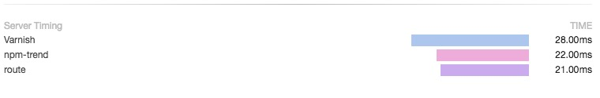
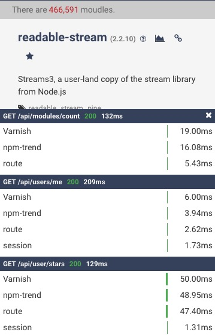

# 更直观的性能展示：Server-Timing

“我这试了一下挺快的，你再刷新一次试试？”这样一句经典的话，估计不少后端程序员在面对测试质疑请求响应慢的口头禅。我们都很清楚，接口慢可能存在很多种的原因，要去慢慢查实在是太麻烦了，很多时候一两次响应慢并不代表什么，所以也就忽悠着就又混过去了。

## 聪明的测试

估计是太多次的把问题抵赖到网络上，测试人员都聪明了，每次测试把chrome的`Network`面板打开，哪个请求慢的，看`Timing`的展示把`Wating(TTFB)`接收到响应的首字节前花费的毫秒数直接截图，这个时候面子挂不住啊，没办法抵赖了，的确是系统响应慢。

一个请求到后端服务，调用到的函数，依赖的服务都有可能是慢的源头，但是慢在哪，难度每次都要看日志一次一次的分析，这太麻烦了。`Network`面板展示的数据很直观，有没有办法能以这种形式展示各类调用的耗时呢？

## Server-Timing

在HTTP的响应头中，`Server-Timing`用于表示响应请求中各阶段使用的时间，其组成主要为三部分(参考https://www.w3.org/TR/server-timing/)：

```
Server-Timing = "Server-Timing" ":" #server-timing-metric

server-timing-metric   = metric  [ ";" description ]
metric                 = metric-name [ "=" metric-value ]
metric-name            = token
metric-value           = 1*digit [ "." 1*digit ]
description            = token | quoted-string
```

- `metric-name` 该统计时长的名字，在chrome的`Network`面板展示`Server-Timing`的时候，使用它来排序展示请耗时柱状图，因此我在使用的时候，一般只使用它来做排序，保证展示的`Server-Timing`与添加的顺序一致，使用`description`来标注
- `metric-value` 处理时长(ms)，chrome老版本中错误的展示了以`s`为单位，新版本已修正
- `description` 该timing的描述，如果有该字段会优先展示该字段，如果没有则展示`name`。可选

下面是请求`/users/me`的`Server-Timing`值：

```
'A=2521.46147;"/users/me(1,2,3)",B=1002.022688;"getUser(2,3)",C=933.468153;"mongodb:get",D=54.064163;"validate:user"'
```

总共有4个处理的`Timing`，其中有包含关系(数字表示包含该处理哪个调用)，主要的流程如下：

- `/users/me` 接收到该请求，使用时间为2秒多(包括了后面的其它调用)
- `getUser` 获取用户信息（包括了mongodb:get与validate:user），使用了1秒多的时间
- `mongodb:get` 从mongodb中获取数据，使用了900多毫秒
- `validate:user` 对用户数据校验

上面展示了一次获取用户信息的响应过程，一般我们只需要在`IO`的相关调用中增加统计就直观的展示接口响应的耗时图。下面是我截的一张`Server-Timing`的展示图，如下（此Server-Timing去除了包含的调用关系）：



如何生成`Server-Timing`，请大家支持我写的node.js模块[supertiming](https://github.com/vicanso/supertiming)。

## Timing View

由于现在主要的还是移动网站比较多，在手机上测试没有PC那么方便直观的展示`Network`中的`Server-Timing`，而且为了方便产品测试的时候能出问题能方便查看，所以需要更便捷的展示接口时间线。

[http-timing](https://github.com/vicanso/http-timing)提供简便的接口记录HTTP响应的状态（状态码，使用时间，Server-Timing等），转换成HTML展示，下面是其展示的效果图：



大家如果想试验一下，也可以打开`http://npmtrend.com/`，在左上角(15px以内）连点三下，则能看到相关的HTTP响应图。
